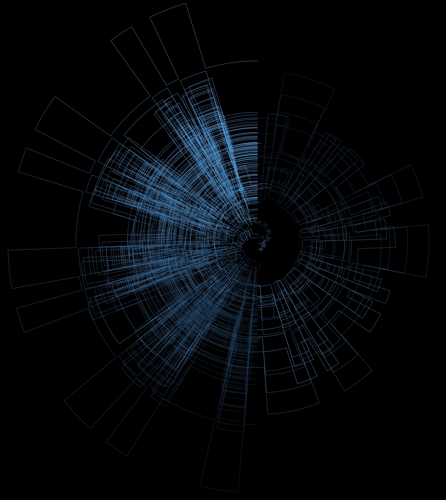
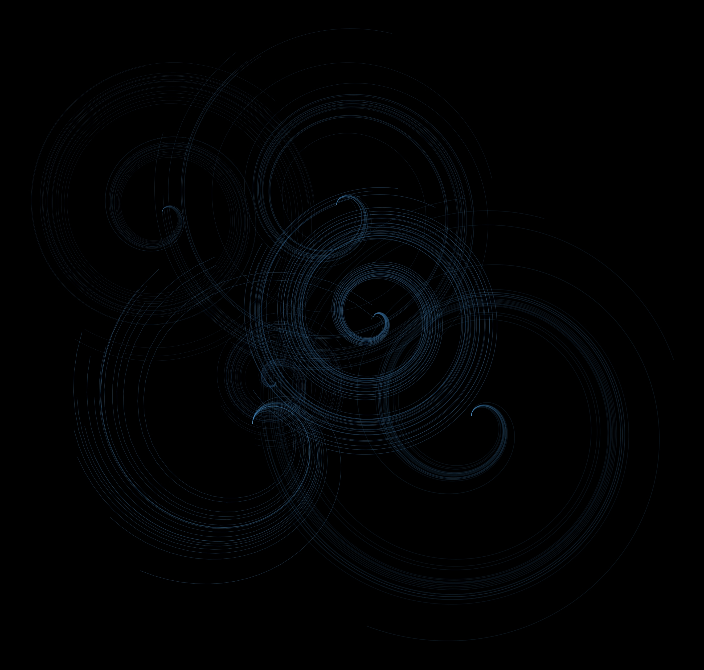

# Generative Art

A rough go at some basic generative art using the R programming language. To make this more interesting, if we can find some uses for using Rcpp, then that's an added bonus!

## A rough plot using circles

## A rough plot trying to combine spirals

**Eventual goal:** can we use protein sequences/structures as inputs for generative art? Perhaps relationships between different sequences could be used?

# Good attractors

[1] -1.194599
[1] -1.080533
[1] -3.572272
[1] -5.291849

[1] -1.262109
[1] -2.078175
[1] 0.3558392
[1] -1.786894